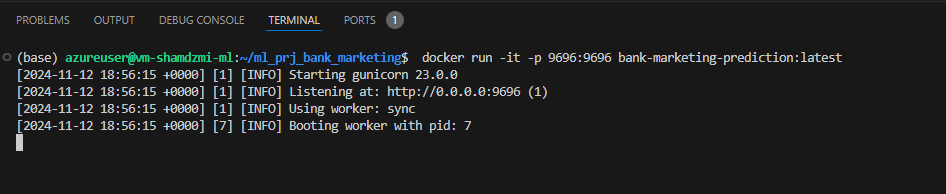
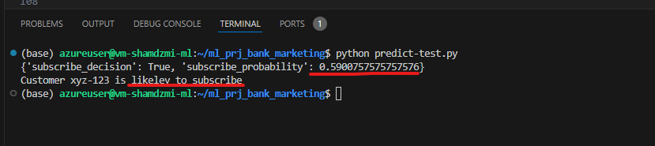

# Bank Marketing Prediction

## Table of Contents
1. [Problem Description](#1-problem-description)
2. [Data Analysis](#2-data-analysis)
3. [Exploratory Data Analysis Results](#3-exploratory-data-analysis-results)
4. [Models Training and Evaluation](#4-models-training-and-evaluation)
5. [Source Code](#5-source-code)
6. [Dependency Management](#6-dependency-management)
7. [Containerization](#7-containerization)
8. [Test Run](#8-test-run)

## 1. Problem Description
A Portuguese banking institution implements direct marketing campaigns primarily based on phone calls. Often, more than one contact with the same client is necessary to determine if the client will subscribe to a bank term deposit product.

**Project Goal**: Predict whether a client will subscribe to a term deposit based on available data about the customer.

The dataset used in this project is publicly available at [OpenML Dataset](https://www.openml.org/search?type=data&sort=runs&status=active&id=1461).

### Dataset Fields
- **Bank client data**:
  1. `age`: Age of the client (numeric)
  2. `job`: Type of job (categorical)
  3. `marital`: Marital status (categorical)
  4. `education`: Education level (categorical)
  5. `default`: Has credit in default? (binary)
  6. `balance`: Average yearly balance, in euros (numeric)
  7. `housing`: Has housing loan? (binary)
  8. `loan`: Has personal loan? (binary)
- **Related with the last contact of the current campaign**:  
  9. `contact`: Contact communication type (categorical)  
  10. `day`: Last contact day of the month (numeric)  
  11. `month`: Last contact month of the year (categorical)  
  12. `duration`: Last contact duration, in seconds (numeric)  
- **Other attributes**:  
  13. `campaign`: Number of contacts performed during this campaign for this client (numeric)  
  14. `pdays`: Number of days that passed by after the client was last contacted from a previous campaign (numeric; -1 means client was not previously contacted)  
  15. `previous`: Number of contacts performed before this campaign for this client (numeric)  
  16. `poutcome`: Outcome of the previous marketing campaign (categorical)  
- **Output variable (desired target)**:  
  17. `y`: Has the client subscribed to a term deposit? (binary)  

## 2. Data Analysis
Data analysis and model selection are performed in the Jupiter notebook: `ml_prj_bank-marketing.ipynb`.

### Notebook Sections
1. Download dataset
2. Prepare data
3. Exploratory Data Analysis (EDA)
4. Train models

All steps are designed to be fully reproducible.

## 3. Exploratory Data Analysis Results
EDA performed in the aforementioned notebook reveals:
- About 11% of customers subscribe to a marketing campaign.
- Significant deviations exist in categorical features that might influence the target outcome.
- Most influential features according to Mutual Information are: `poutcome`, `month`, `contact`.
- `duration`, `previous`, and `pdays` are key numerical features according to correlation analysis.

## 4. Models Training and Evaluation
Four models were evaluated: Logistic Regression, Random Forest, Decision Tree, and XGBoost. Each model's performance was assessed using the Area Under the Curve (AUC) metric, then tuned to maximize AUC values:

| Model               | Max AUC |
|---------------------|---------|
| Logistic Regression | 0.907   |
| Decision Tree       | 0.883   |
| Random Forest       | 0.930   |
| XGBoost             | 0.926   |

`Random Forest` achieved the best result with parameters `n_estimators=120` and `max_depth=6`, and thus was selected for deployment.

## 5. Source Code
The project includes three Python scripts:
- `train.py`: Trains the selected model on the dataset and saves it to `model.bin`.
- `predict.py`: Launches a Flask web service on port `9696` with a `/predict` API method. It accepts JSON with customer data as input and returns the prediction.
- `predict-test.py`: Auxiliary script that calls the API on `localhost:9696/predict` with sample JSON, and prints out the prediction result.

## 6. Dependency Management
The project uses `pipenv` for environment isolation and dependency management. To set up the environment and install all required dependencies:
```bash
pipenv shell
pipenv install
```


## 7. Conteinerization
Application can be packed into a Docker-image. Dockerfile contains instructions to build a docker-image.
In order to build docker immage, excute:
```bash
docker build -t bank-marketing-prediction .
```
In order to launc the docker-container (and forward the port 9696) execute the comand:
```bash
docker run -it -p 9696:9696 bank-marketing-prediction:latest
```

## 8. Test run
  Start the docker-conatiner with the main aplication: 

   

  Run a test-scrit from a separate terminal window:

   

